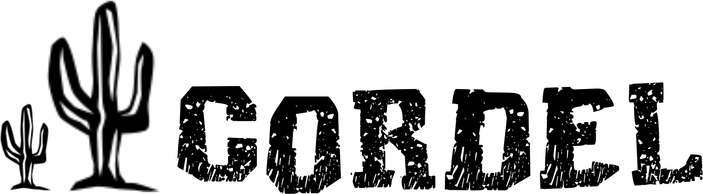
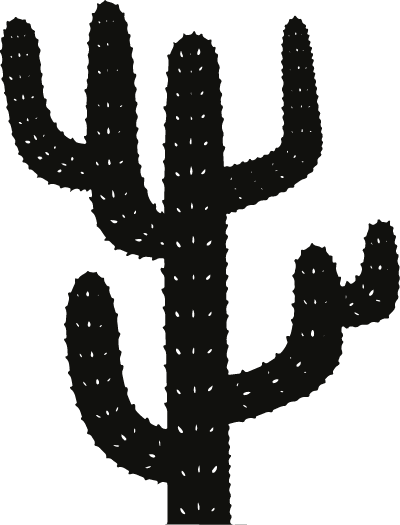

    

##

    <h1>Projeto Cordel</h1>
    
Este projeto foi desenvolvido durante a realização do curso de HTML5 e CSS do <a href="https://www.cursoemvideo.com/">Curso em Video</a>. Com este projeto foi possivel praticar o HTML semântico uso de fontes externas, imagens de fundo fixadas e posições de imagens.

    
A literatura de cordel é um gênero literário popular escrita em versos, que se popularizou na região norte e nordeste do Brasil na epocá do século XVIII, e era/são publicadas em pequenas brochuras impressas penduradas em cordas ou em cordéis, podendo também estar acompanhadas de xilogravuras.

    
O texto utilizado para criar este projeto foi escrito por <a href="https://www.recantodasletras.com.br/poesias/3186743">Milton Duarte</a>, neste o autor fala sobre as redes sociais e sobre a internet.

    

        
    

    

        Confira <a href="https://github.com/mendjoy/projeto-cordel/deployments/activity_log?environment=github-pages">aqui</a>
    

